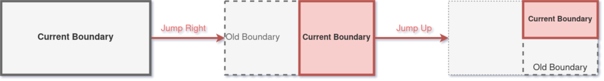

# Manual

## Table of Contents

- [Table of Contents](#table-of-contents)
- [Intallation](#intallation)
- [Boundary](#boundary)
- [Configuration](#configuration)
	- [Notes](#notes)
	- [Description](#description)
- [Modes](#modes)
	- [Capture mode](#capture-mode)
	- [Script mode](#script-mode)
		- [Notes](#notes-1)
		- [List of Action Codes](#list-of-action-codes)
		- [Testing](#testing)
	- [Monitor mode](#monitor-mode)

## Intallation

> I'm currently working on building binaries for Windows and Linux. Stay tuned.

Make sure you have `setuptools>=60` installed. Install it with `pip install setuptools`.

Run the following command to install the dependencies:

```bash
pip install -e .
```

## Boundary

"Boundary" is a terminology apply for **jump movements**, indicates the area that have the mouse cursor at the center of it. The root boundary is the screen.

Jump actions will move the cursor to the **center** of the boundary **half the area of the current** boundary in the direction of the jump.

For example, if you perform a jump to the right, the cursor will move to the center point between its current position and the right edge of the boundary, which is also the center of the boundary that takes up half the area to the right of the current boundary.



The boundary is only used for and changed by jump actions. The cursor will not be constrained to the boundary when moving the cursor with step movement or the physical mouse.

## Configuration

The configuration file is a JSON file. You can see the template configuration file [here](template-config.json).

The initial run of the program will prompt you to generate a config file with default values. You can modify it afterwards.

> The initial run will cause the program to crash. This is to be expected. You just need to run it again.

### Notes

- To improve stability/predictivity of key sequence capturing, **continuous movement isn't possible**, which means holding down a key will only trigger the action once.
- All alphabetic characters are **case-insensitive** but should be in lowercase.
- When using **Shift** in key sequence:
	- For `Shift+1`, the keymap will be **`shift+!`**. Same for other numeric and special characters.
	- For `Shift+Space`, the keymap will be **`shift+none`** (yes, it's weird it works).
		- When there's no `Shift` key in the sequence, **`space`** MUST be used instead.
- The config file's directory is fixed to be the same directory as the executable. If you want to place it in another directory, you can create a symbolic link.
- **All configs MUST be present** in the config file. If any config is missing, the program will ask to create a new config file with the default values.

### Description

**`key_centralize`**: Move the cursor to the center of the current boundary.

**`key_centralize_root`**: Move the cursor to the center of the current screen and set boundary to be the current screen.

**`key_click_left`**: Emulate left mouse button click.

**`key_jump_left`**: Move the cursor left in jump mode.

**`key_left`**: Move the cursor left in step mode.

**`key_quit`**: Quit the program.

**`key_screen_next`**: Move the cursor to the center of the next screen in the screen list.

**`key_screen_prev`**: Move the cursor to the center of the previous screen in the screen list.

**`key_scroll_up`**: Emulate scrolling up.

> :warning: Horizontal scrolling is only supported on Linux and macOS. Might work on other *nix systems but not tested.

**`key_toggle_hold_left`**: Emulate left mouse button hold/release.

**`screen_default`**: The index of the screen that will be used as the root screen.

**`screen_list`**: An ordered list of all screens' top-left and bottom-right coordination tuple relative to the combined boundary of all the screens.

**`screen_size`**: The total dimension of all screens, depends on how you set up your screens in the settings.

**`scroll_multiplier`**: Multiplier for scrolling actions.

**`step_multiplier`**: Multiplier for step movements.

## Modes

You can pass in several flags to the program. Use `--help` for more details.

If no flag is passed in, the program will run in **Capture** mode.

The program will only run in one mode during its lifetime. If you pass in multiple mode flags, the program will prioritize with the following order: `--capture` > `--script` > `--monitor`.

### Capture mode

**Capture** mode is used to capture key sequences and perform actions based on the configuration file. Activate it by passing in the `-c` (or `--capture`) flag.

In Capture mode, all keyboard input will be captured by the program and will not be passed to other applications, even the terminal. That's why you can only exit the program by pressing the key that is mapped to `key_quit` in the config file (default is `Esc` key).

### Script mode

**Script** mode is used to automate the actions using a plain text file. Activate it by passing in the `-s` (or `--script`) flag followed by the directory of the script files separated by whitespace.

The structure of the script file is as follows:

```plain
<action_code> <argument_0> <argument_1> ...
```

#### Notes

- All arguments MUST present and in order as shown in the list above.
- All time-related arguments are in milliseconds.
- `quit` action will cause the program to exit immediately, thus won't be able to execute the scripts after it.

#### List of Action Codes

```plain
centralize
centralize_root
click_left -1 -1 1 0    // x, y, clicks, delay
click_right -1 -1 1 0   // x, y, clicks, delay
down 1                  // steps
drag_abs left 0 0 0     // button, x, y, duration | Possible button names: left, right, middle
drag_rel left 0 0 0     // button, x, y, duration
jump_down
jump_left
jump_right
jump_up
left 1                  // steps
move_abs 0 0 0          // x, y | Move relative to absolute coordinate
move_rel 0 0 0          // x, y | Move relative to current position
quit 0                  // code | 0 for normal exit, other values for error
right 1                 // steps
screen_index 0          // index | Negative value to count from the end with -1 being the last screen
screen_next 1           // steps
screen_prev 1           // steps
scroll_down 1 10        // multiplier, delay
scroll_left 1 10        // multiplier, delay
scroll_right 1 10       // multiplier, delay
scroll_up 1 10          // multiplier, delay
toggle_hold_left
toggle_hold_middle
toggle_hold_right
up 1                    // steps
wait 0                  // duration
```

#### Testing

You can see the sample script file [here](sample-script.txt). Test it out by running

```bash
python cymuk.py -s ./docs/sample-script.txt
```

A handy website for you to test out the script: [Link](https://www.onlinemictest.com/mouse-test/).

### Monitor mode

**Monitor** mode is used to monitor the mouse cursor's position and print it out to the terminal. Activate it by passing in the `-m` (or `--monitor`) flag.

This mode serves purely as a convinient way to get the cursor's position on supported platforms. You can use system-specific tools to get more detailed information.
